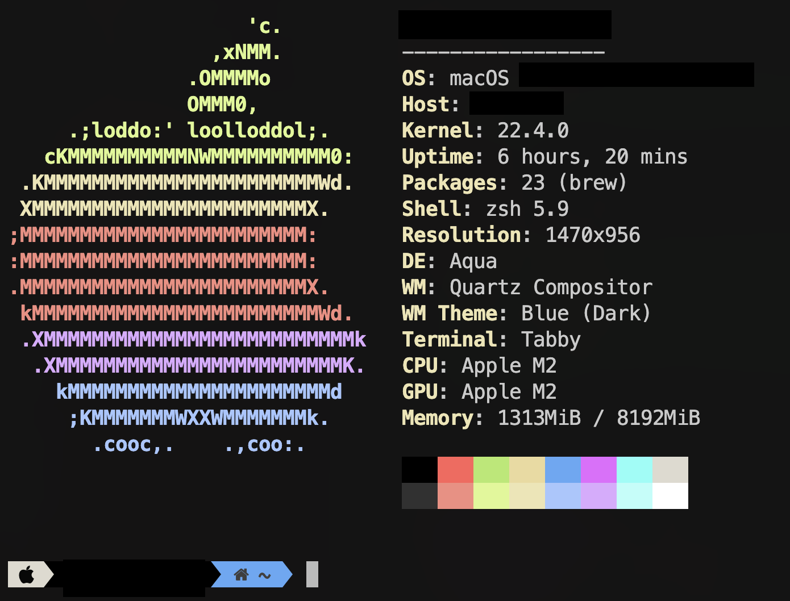

<p align="center">
  <a href="#"></a>
</p>
<p align="center">
    Update : 2023-05-16<br />
</p>
<p align="center">
    <a href="#"> </a>
    <a href="#"> </a>
    <a href="#"></a>
    <a href="#"></a>
    <br />
    
</p> 

## ⚡️ Informations
**Operating System :** MacOS Ventura

**Terminal Client :** [Tabby](https://tabby.sh/)

**Text Editor :** [VSCode](https://code.visualstudio.com)

**Icons :** [MesloLGS NF](https://github.com/romkatv/powerlevel10k#meslo-nerd-font-patched-for-powerlevel10k)

## 📦️ Packages
### 🐚 Shell
 - [zsh](https://www.zsh.org/) : More intuitive than bash
  
### 🥡 Commands
 - [bat](https://github.com/sharkdp/bat) : Better `cat`
 - [btop](https://github.com/aristocratos/btop) : Better `htop`
 - [cheat](https://github.com/cheat/cheat) : Better `man`, all your cheatsheet in your terminal 
 - [duf](https://github.com/muesli/duf) : Better `df -h`with graphics (Thx [@Lucroz94](https://github.com/Lucroz94))
 - [exa](https://the.exa.website/) : Improving the `ls` command
 - [ncdu](https://dev.yorhel.nl/ncdu) : Display your storage simply and graphically

### 🌮 Theme + Frameworks
 - [oh-my-zsh](https://ohmyz.sh/) : Making zsh pretty
 - [powerlever10k](https://github.com/romkatv/powerlevel10k) : Customize your command prompt to perfection

### ⚒️ Tools
 - [zsh-autosuggestions](https://github.com/zsh-users/zsh-autosuggestions) : Like fish, add auto-completion
 - [zsh-syntax-highlighting](https://github.com/zsh-users/zsh-syntax-highlighting) : Like fish too, add highlighting


## ⚙️ Install for MacOS

### Powerlevel10k
```shell
brew install romkatv/powerlevel10k/powerlevel10k
echo "source $(brew --prefix)/opt/powerlevel10k/powerlevel10k.zsh-theme" >> ~/.zshrc
```
### zsh-autosuggestions
```shell
git clone https://github.com/zsh-users/zsh-autosuggestions ~/.zsh/zsh-autosuggestions
echo "source ~/.zsh/zsh-autosuggestions/zsh-autosuggestions.zsh" >> ~/.zshrc
```

### zsh-syntax-highlighting
```shell
git clone https://github.com/zsh-users/zsh-syntax-highlighting.git ~/.zsh/zsh-syntax-highlighting
echo "source ~/.zsh/zsh-syntax-highlighting/zsh-syntax-highlighting.zsh" >> ~/.zshrc
```

### exa
```shell
brew install exa
```

### bat
```shell
brew install bat
```

### btop
```shell
brew install btop
```

### ncdu
```shell
brew install ncdu
```

### duf
```shell
brew install duf
```

### fd
```shell
brew install fd
```

### cheat
```shell
brew install cheat
```

## 🎁 Bonus : un script d’installation

```shell
zsh -c "$(curl -s https://raw.githubusercontent.com/Aiola13/zsh-profile/main/macos_install_utils.zsh)"
```