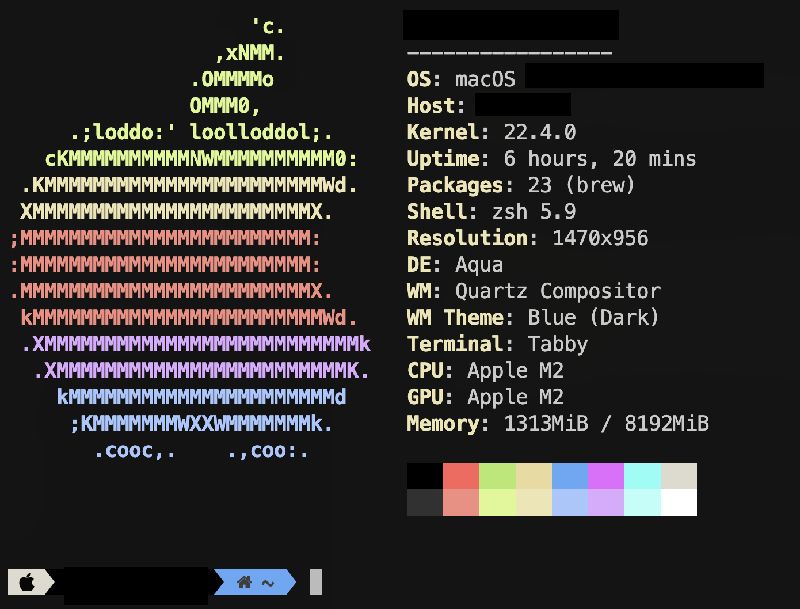

<p align="center">
  <a href="#"></a>
</p>
<p align="center">
    Update : 2026-06-02<br />
</p>
<p align="center">
    <a href="#"> </a>
    <a href="#"> </a>
    <a href="#"></a>
    <a href="#"></a>
    <br />
    
</p> 

## Informations
**Operating System :** macOS

**Terminal Client :** [Tabby](https://tabby.sh/)

**Text Editor :** [VSCode](https://code.visualstudio.com)

**Icons :** [MesloLGS NF](https://github.com/romkatv/powerlevel10k#meslo-nerd-font-patched-for-powerlevel10k)

## Packages
### Shell
 - [zsh](https://www.zsh.org/) : More intuitive than bash

### Commands
 - [bat](https://github.com/sharkdp/bat) : Better `cat`
 - [btop](https://github.com/aristocratos/btop) : Better `htop`
 - [cheat](https://github.com/cheat/cheat) : Better `man`, all your cheatsheets in your terminal
 - [duf](https://github.com/muesli/duf) : Better `df -h` with graphics (Thx [@Lucroz94](https://github.com/Lucroz94))
 - [eza](https://github.com/eza-community/eza) : Modern replacement for `ls` (maintained fork of exa)
 - [fastfetch](https://github.com/fastfetch-cli/fastfetch) : System info on launch (faster neofetch)
 - [fd](https://github.com/sharkdp/fd) : Better `find`
 - [ncdu](https://dev.yorhel.nl/ncdu) : Display your storage simply and graphically

### Theme + Frameworks
 - [oh-my-zsh](https://ohmyz.sh/) : Framework for managing your zsh configuration
 - [powerlevel10k](https://github.com/romkatv/powerlevel10k) : Customize your command prompt to perfection

### Tools
 - [zsh-autosuggestions](https://github.com/zsh-users/zsh-autosuggestions) : Like fish, fish-like autosuggestions
 - [zsh-syntax-highlighting](https://github.com/zsh-users/zsh-syntax-highlighting) : Like fish too, command syntax highlighting

### Oh My Zsh plugins
`git` · `docker` · `docker-compose` · `sudo` · `history` · `colored-man-pages` · `extract` · `web-search` · `zsh-autosuggestions` · `zsh-syntax-highlighting`

## Install for macOS

### One-liner (recommended)
The install script handles everything: Homebrew, the CLI tools, Oh My Zsh,
Powerlevel10k, the plugins, and copies the config files into your home.

```shell
zsh -c "$(curl -fsSL https://raw.githubusercontent.com/Aiola13/zsh-profile/main/macos_install_utils.zsh)"
```

<details>
<summary>Or clone the repo first</summary>

```shell
git clone https://github.com/Aiola13/zsh-profile.git
cd zsh-profile
zsh macos_install_utils.zsh
```

</details>

### Manual install

#### Homebrew packages
```shell
brew install fastfetch bat eza btop ncdu duf fd cheat
```

#### Oh My Zsh
```shell
sh -c "$(curl -fsSL https://raw.githubusercontent.com/ohmyzsh/ohmyzsh/master/tools/install.sh)"
```

#### Powerlevel10k (as an Oh My Zsh theme)
```shell
git clone --depth=1 https://github.com/romkatv/powerlevel10k.git \
  "${ZSH_CUSTOM:-$HOME/.oh-my-zsh/custom}/themes/powerlevel10k"
```

#### zsh-autosuggestions
```shell
git clone https://github.com/zsh-users/zsh-autosuggestions \
  "${ZSH_CUSTOM:-$HOME/.oh-my-zsh/custom}/plugins/zsh-autosuggestions"
```

#### zsh-syntax-highlighting
```shell
git clone https://github.com/zsh-users/zsh-syntax-highlighting.git \
  "${ZSH_CUSTOM:-$HOME/.oh-my-zsh/custom}/plugins/zsh-syntax-highlighting"
```

#### Config files
```shell
cp .zshrc ~/.zshrc
cp .p10k.zsh ~/.p10k.zsh
exec zsh
```
